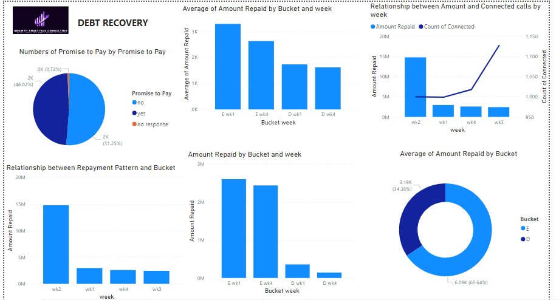
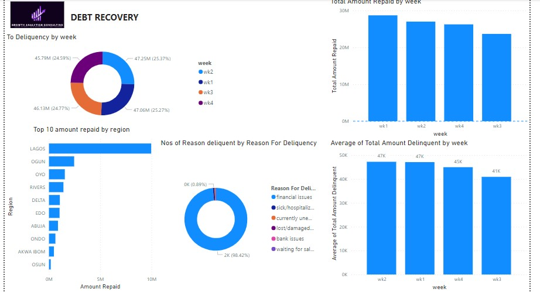

# Debt-Recovery
Debt Recovery for a fast-growing Fintech Lender Company
Here’s your content converted into markdown for GitHub:

# Debt Collections Analysis for Fintech Lender  

## Problem Statement  

A debt collections team has been charged with the task of recovering **NGN10 million** for a fast-growing Fintech Lender over a 2-month period. The provided dataset contains debtors' information for over 4 weeks, including loan collection and repayment details. This report aims to answer several business intelligence questions and provide actionable insights.

---



## 1. What percentage of calls resulted in a promise to pay?  

The pie chart analysis revealed:  
- **48%** of the calls resulted in a positive response ('Yes'), indicating a commitment to pay.  
- **51.25%** were negative responses ('No'), indicating unwillingness to pay.  

---

## 2. What was the week-on-week repayment growth rate?  

*To be calculated based on the dataset.*

---

## 3. Performance of Buckets in the Last Week vs. First Week  

- **Bucket E**:  
  - First Week: NGN 25 million  
  - Last Week: NGN 2.44 million  

- **Bucket D**:  
  - First Week: NGN 0.36 million  
  - Last Week: NGN 0.14 million  

- Average repayment values (Figure d):  
  - **Bucket E**: 3,283 (first week) vs. 2,623 (last week)  
  - **Bucket D**: 1,731 (first week) vs. 1,671 (last week)  

---


## 4. Relationship Between Connected Calls and Repayments  

- Figure E reveals an **inverse relationship** between connected calls and repayments.  
- **Week 2**: The highest amount repaid (NGN 14 million) with 1,000 connected calls.  
- **Week 3**: The lowest repayment (NGN 2.43 million) with 1,127 connected calls.  
- Fewer calls in Week 3 resulted in higher recoveries, suggesting diminishing returns with excessive calls.

---

## 5. Main Difference in Repayment Patterns Between Buckets  

- **Bucket E** consistently has a **higher repayment value** than Bucket D (Figure F):  
  - **Week 1**: E = NGN 2.6 million, D = NGN 0.4 million  
  - **Week 2**: E = NGN 12.8 million, D = NGN 2.0 million  
  - **Week 3**: E = NGN 2.18 million, D = NGN 0.25 million  
  - **Week 4**: E = NGN 2.44 million, D = NGN 0.14 million  

---


## 6. Which Bucket Has the Highest Average Repayment Value?  

- **Bucket E** has the highest average value, **NGN 6,0817** (Figure G).  

---

## 7. Which Region Has the Highest Repayment Rate?  

- **Lagos** recorded the highest repayment rate, **NGN 10 million** (Figure H).  

---

## 8. What Was the Average Delinquent Amount Per Account by Week?  

- **Week 2** had the highest average delinquent amount per account: **NGN 47,245**.  

---

## 9. How Should We Engage Delinquent Customers in the Future?  

Based on the 98.42% delinquency due to financial issues, future engagements should include:  
- **Flexible payment options**  
- **Transparent communication** about the implications of continued delinquency and benefits of resolving outstanding debt  
- **Financial education** on budgeting, debt reduction, and automated savings strategies  
- **Guarantor recommendation** for prospective borrowers  
- **Additional metrics** (e.g., educational background and loan purpose) to screen future borrowers more effectively  

---

## 10. Recommendations to Improve Performance  

1. **Personalized Debt Recovery Plans**: Create customized plans based on customers' earnings and financial situations, addressing the primary reason for delinquency.  
2. **Regional Analysis**: Offer more loans in communities like **Lagos**, which achieved the highest recovery (NGN 10 million).  
3. **Prioritize Loan Approval for "E" Customers**: Focus on customers in **Bucket E**, as they have higher repayment rates.  
4. **Consistent Follow-Up**: Implement systematic follow-ups to monitor payments and send timely reminders.  
5. **Behavioral Analysis and Customer Profiling**:  
   - Since 51.25% are unwilling to pay, analyze spending habits, income sources, and financial priorities.  
   - Recommend automated savings or deductions to improve repayment compliance.  

---

This report provides actionable insights into the debt recovery efforts, with strategies to optimize customer engagement and enhance repayment performance.
``` 
